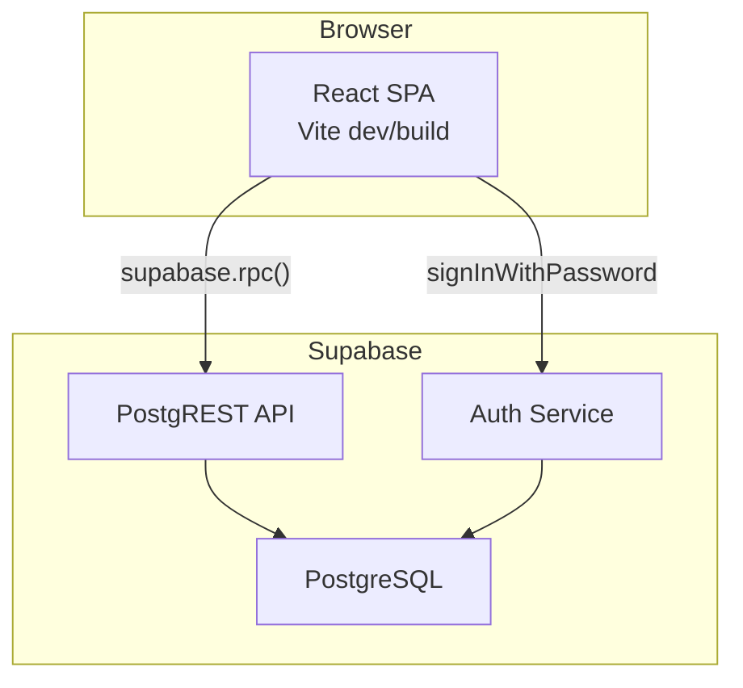
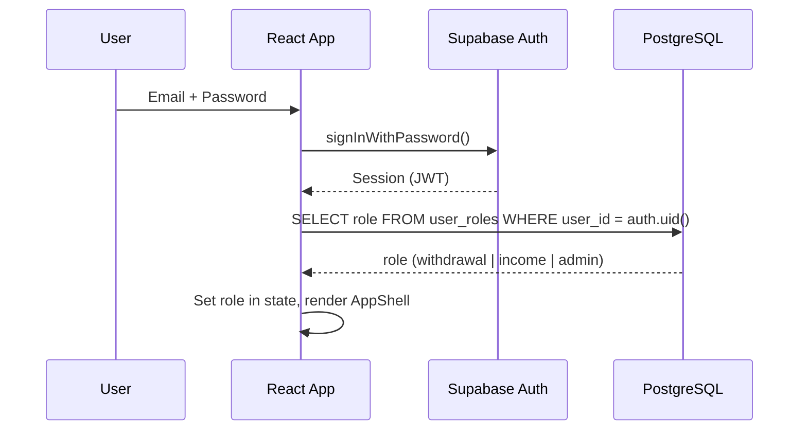

# Architecture

## Overview

Thai Bank Ledger is a React SPA that connects directly to Supabase. There is no custom backend server — all business logic lives in PostgreSQL RPC functions with `SECURITY DEFINER` to enforce access control.

## Authentication & Authorization

Roles are stored in `user_roles` table. RPC functions use `auth.uid()` internally to enforce row-level access — the frontend role is for UI gating only.

## Data Access Pattern

All data queries go through PostgreSQL RPC functions, not direct table access:

| RPC Function | Purpose |
|---|---|
| `get_transactions_v2` | Paginated, filtered transaction list with RLS |
| `get_transaction_stats_v2` | Aggregated totals respecting filters |
| `get_latest_balance` | Latest balance (admin only) |
| `import_transactions` | Timestamp-filtered bulk insert from CSV |
| `update_memo` | Edit memo/รายการ field |
| `update_remark` | Edit remark field (admin) |
| `toggle_highlight` | Toggle row highlight (admin) |

## Key Architectural Decisions

1. **RPC over direct table access** — All queries wrapped in `SECURITY DEFINER` functions. Client never queries `transactions` table directly.
2. **No custom backend** — Supabase handles auth, storage, and API. Zero server code.
3. **Single data hook** — `useTransactions` encapsulates all data fetching, pagination, filtering, sorting, and optimistic updates.
4. **Optimistic updates** — Memo, remark, and highlight edits update UI immediately, revert on failure.
5. **CSS-only styling** — No CSS framework. Design tokens in `index.css`, component styles co-located.
6. **TIS-620 CSV parsing** — Client-side parser handles Thai encoding from Kasikorn Bank exports.
