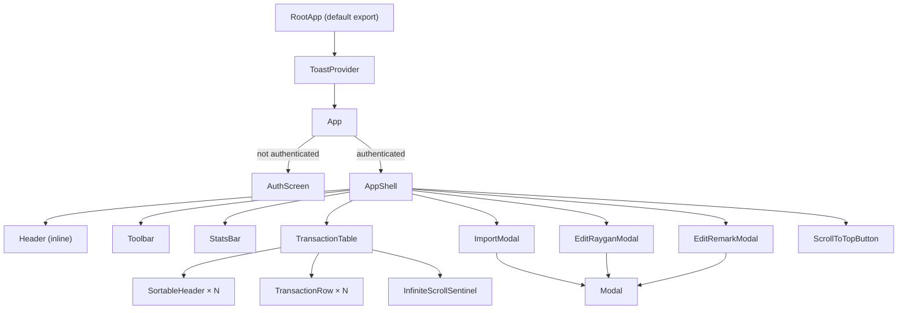

# Components

## Component Tree

## Component Responsibilities

### App (`src/App.jsx`)
- Manages auth state (user, role, session restore)
- Routes between AuthScreen and AppShell
- Wraps tree with ToastProvider

### AuthScreen (`src/components/AuthScreen.jsx`)
- Email/password login form
- Validates Supabase config presence
- Calls `supabase.auth.signInWithPassword()`

### AppShell (`src/components/AppShell.jsx`)
- Authenticated layout container
- Instantiates `useTransactions(role)` — single source of data
- Manages modal open/close state
- Coordinates all child component interactions

### Toolbar (`src/components/Toolbar.jsx`)
- Global search input
- Type filter dropdown (disabled for accountants)
- Date range pickers
- Import/Export CSV buttons (admin only)

### StatsBar (`src/components/StatsBar.jsx`)
- Shows total transactions, withdrawal sum, deposit sum
- Admin sees net gain and current balance
- Role-aware: hides irrelevant stats per role

### TransactionTable (`src/components/TransactionTable.jsx`)
- Renders sortable header row + transaction body
- Column config varies by role (admin sees balance, remark, highlight)
- Delegates row rendering to TransactionRow
- InfiniteScrollSentinel at bottom for pagination

### TransactionRow (`src/components/TransactionRow.jsx`)
- Single transaction row
- Conditional edit buttons for memo/remark
- Highlight toggle (admin, with optimistic + in-flight guard)
- Visual cues: missing memo highlight, row highlight state

### ImportModal (`src/components/ImportModal.jsx`)
- Drag-and-drop or click file upload
- Client-side CSV parsing (TIS-620/UTF-8)
- Preview table (first 6 rows)
- Single call to `import_transactions` RPC (no chunking)

### EditRayganModal (`src/components/EditRayganModal.jsx`)
- Edit memo (รายการ) field for a transaction
- Calls `update_memo` RPC
- Optimistic update via callback

### EditRemarkModal (`src/components/EditRemarkModal.jsx`)
- Edit remark (หมายเหตุ) field — admin only
- Calls `update_remark` RPC
- Same pattern as EditRayganModal

### Modal (`src/components/Modal.jsx`)
- Reusable modal wrapper (title, footer slots, backdrop click close)

### SortableHeader (`src/components/SortableHeader.jsx`)
- Column header with sort indicator + optional inline filter input

### InfiniteScrollSentinel (`src/components/InfiniteScrollSentinel.jsx`)
- IntersectionObserver-based sentinel for triggering `loadMore`
- Shows loading state and progress count

### ScrollToTopButton (`src/components/ScrollToTopButton.jsx`)
- Floating button, appears on scroll down

### Spinner (`src/components/Spinner.jsx`)
- Simple CSS loading spinner
