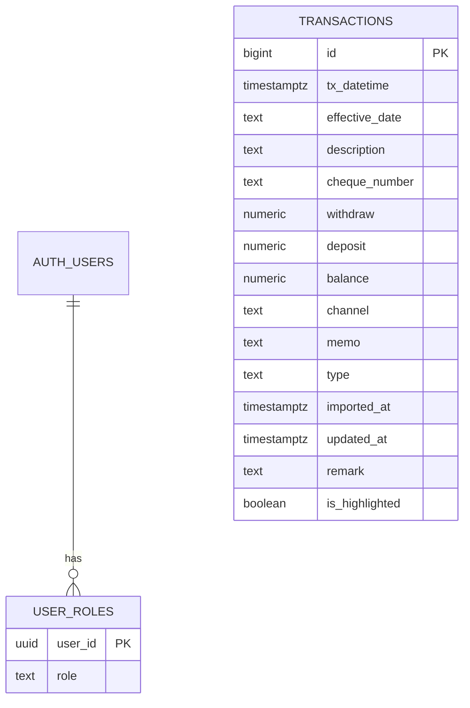

# Data Models

## Database Schema

### `transactions` table

Primary and only data table.

| Column | Type | Constraints | Description |
|--------|------|-------------|-------------|
| `id` | bigint | PK, auto-increment | Row identifier |
| `tx_datetime` | timestamptz | NOT NULL | Transaction timestamp |
| `effective_date` | text | nullable | Effective date (raw string from CSV) |
| `description` | text | nullable | Bank description |
| `cheque_number` | text | nullable | Cheque number if applicable |
| `withdraw` | numeric(18,2) | nullable | Withdrawal amount |
| `deposit` | numeric(18,2) | nullable | Deposit amount |
| `balance` | numeric(18,2) | nullable | Running balance |
| `channel` | text | nullable | Transaction channel |
| `memo` | text | nullable | Accountant-editable note (รายการ) |
| `type` | text | NOT NULL, CHECK | `'withdrawal'` or `'income'` |
| `imported_at` | timestamptz | DEFAULT now() | Import timestamp |
| `updated_at` | timestamptz | DEFAULT now() | Last update |
| `remark` | text | nullable | Admin comment (หมายเหตุ) |
| `is_highlighted` | boolean | NOT NULL DEFAULT false | Admin highlight flag |

**Type constraint:** `type IN ('withdrawal', 'income')`

---

### `user_roles` table

Maps authenticated users to application roles.

| Column | Type | Description |
|--------|------|-------------|
| `user_id` | uuid | FK → auth.users.id |
| `role` | text | `'withdrawal'`, `'income'`, or `'admin'` |

---

## Client-Side Data Structures

### Parsed CSV Row (from `parseBankCSV`)

```javascript
{
  tx_datetime: string,      // ISO format after Thai→Gregorian conversion
  effective_date: string|null,
  description: string|null,
  cheque_number: string|null,
  withdraw: number|null,
  deposit: number|null,
  balance: number|null,
  channel: string|null,
  type: 'withdrawal'|'income',  // derived: withdraw != null → 'withdrawal'
}
```

### Filter State Object

```javascript
{
  search: '',        // Global search term
  type: '',          // 'withdrawal' | 'income' | ''
  channel: '',       // Channel filter
  dateFrom: '',      // ISO date string
  dateTo: '',        // ISO date string
  colDesc: '',       // Column filter: description
  colCheque: '',     // Column filter: cheque_number
  colMemo: '',       // Column filter: memo
  colRemark: '',     // Column filter: remark
  colChannel: '',    // Column filter: channel
  colWithdraw: '',   // Column filter: exact withdraw amount
  colDeposit: '',    // Column filter: exact deposit amount
  colBalance: '',    // Column filter: exact balance
}
```

### Stats Object

```javascript
{
  total: number,       // Total matching rows
  withdraws: number,   // Sum of withdrawals
  deposits: number,    // Sum of deposits
  balance: number|null // Latest balance (admin only)
}
```

## Entity Relationship



Note: No FK between `transactions` and `user_roles` — RLS is enforced via RPC functions checking `auth.uid()` against `user_roles`.

## Indexes

| Index | Columns | Type | Purpose |
|-------|---------|------|---------|
| `transactions_pkey` | `id` | PK | Primary key |
| `idx_tx_date` | `tx_datetime DESC` | BTREE | Sort performance |
| `idx_tx_type` | `type` | BTREE | Role-based filtering |
| `idx_tx_channel` | `channel` | BTREE | Channel filter |
| `idx_tx_balance` | `balance` | BTREE | Balance lookup |

## Triggers

- **`set_updated_at`** — BEFORE UPDATE on `transactions`: sets `updated_at = NOW()` automatically.

## RLS Policies

Both table-level RLS policies AND function-level checks (SECURITY DEFINER with explicit role validation). Belt-and-suspenders approach.

| Policy | Operation | Condition |
|--------|-----------|-----------|
| `tx_select_admin` | SELECT | role = 'admin' |
| `tx_select_withdrawal` | SELECT | role = 'withdrawal' AND type = 'withdrawal' |
| `tx_select_income` | SELECT | role = 'income' AND type = 'income' |
| `tx_insert_admin` | INSERT | role = 'admin' |
| `tx_update_admin` | UPDATE | role = 'admin' |
| `tx_update_withdrawal` | UPDATE | role = 'withdrawal' AND type = 'withdrawal' |
| `tx_update_income` | UPDATE | role = 'income' AND type = 'income' |
| `user_roles_self` | SELECT | auth.uid() = user_id |
