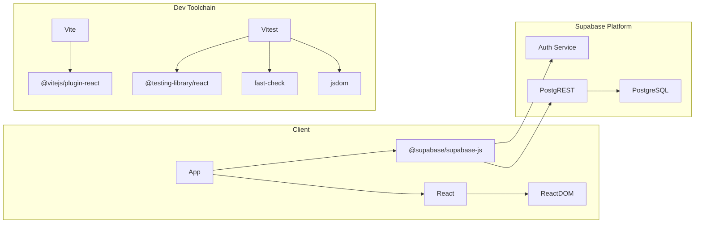

# Dependencies

## Runtime Dependencies

| Package | Version | Purpose |
|---------|---------|---------|
| `react` | ^18.3.0 | UI framework |
| `react-dom` | ^18.3.0 | React DOM renderer |
| `@supabase/supabase-js` | ^2.45.0 | Supabase client (auth, database, RPC) |

## Dev Dependencies

| Package | Version | Purpose |
|---------|---------|---------|
| `vite` | ^6.4.3 | Build tool and dev server |
| `@vitejs/plugin-react` | ^4.3.0 | React Fast Refresh for Vite |
| `vitest` | ^4.1.7 | Test runner (Vite-native) |
| `@testing-library/react` | ^16.3.2 | React component testing utilities |
| `@testing-library/jest-dom` | ^6.9.1 | DOM assertion matchers |
| `fast-check` | ^4.8.0 | Property-based testing library |
| `jsdom` | ^29.1.1 | DOM environment for tests |
| `typescript` | ^5.9.3 | Type checking (used in tooling, not source) |
| `supabase` | ^2.109.1 | Supabase CLI (migrations, local dev) |

## External Services

| Service | Role | Notes |
|---------|------|-------|
| Supabase (hosted) | Auth + Database + API | All backend functionality |
| Kasikorn Bank CSV | Data source | TIS-620 encoded exports parsed client-side |

## Dependency Graph

## Notable Choices

- **Zero UI libraries** — No component framework (MUI, Chakra, etc.). All styling in plain CSS with design tokens.
- **Minimal runtime deps** — Only 3 packages: React, ReactDOM, Supabase client.
- **Property-based testing** — Uses `fast-check` for testing hook behavior with randomized inputs.
- **No state management library** — All state in hooks + component state. No Redux/Zustand/Jotai.
- **No router** — Single-page, no client-side routing. Auth state determines what renders.
