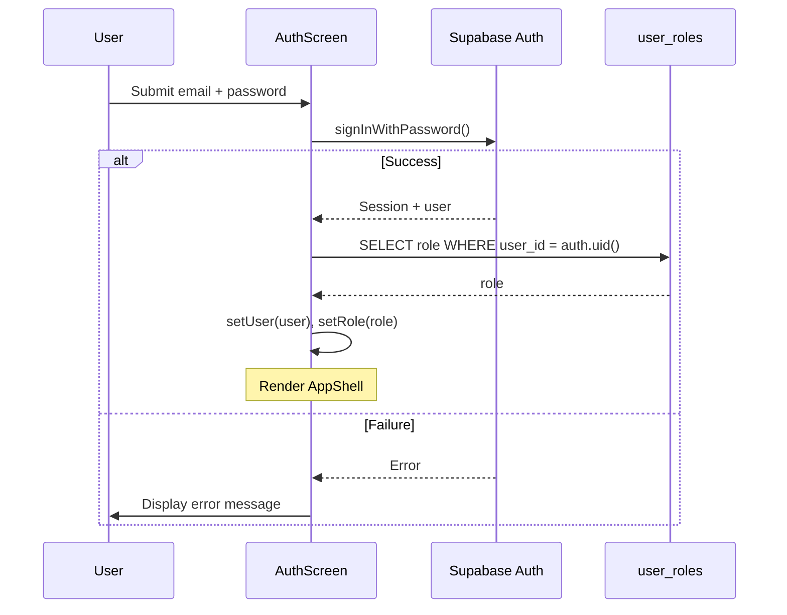
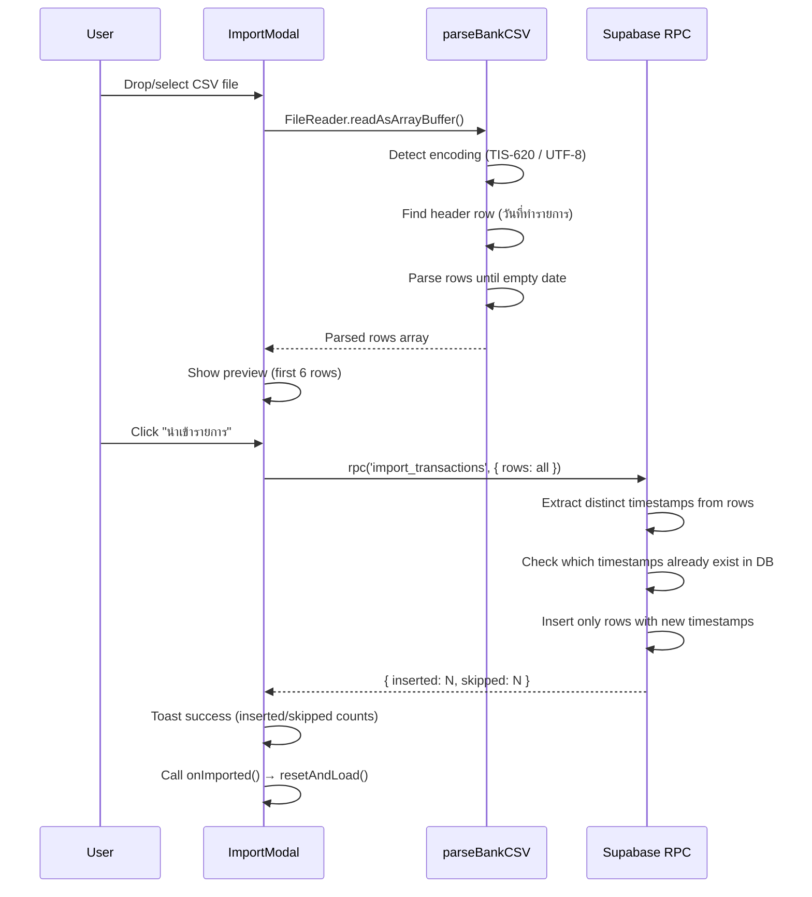
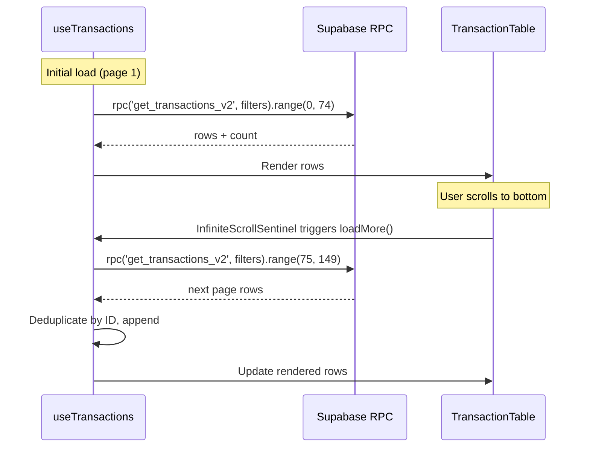
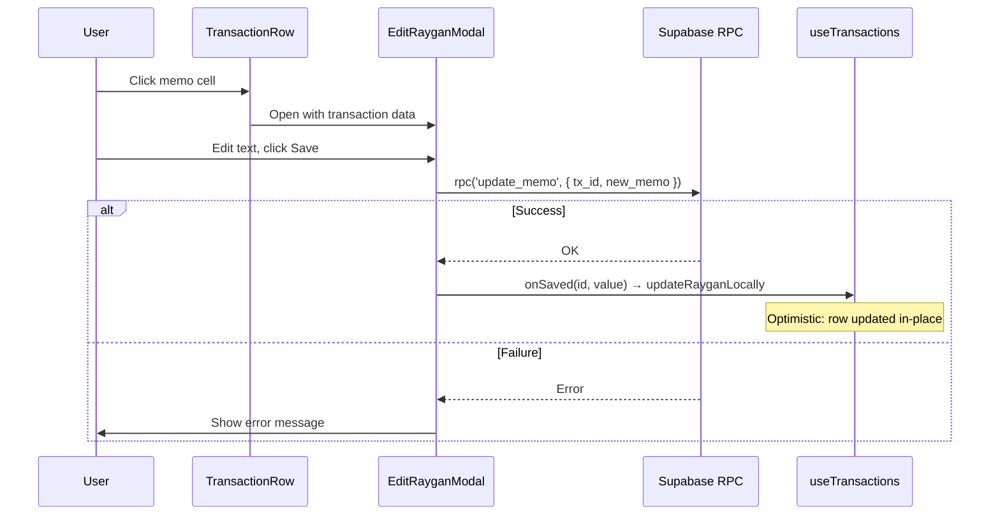
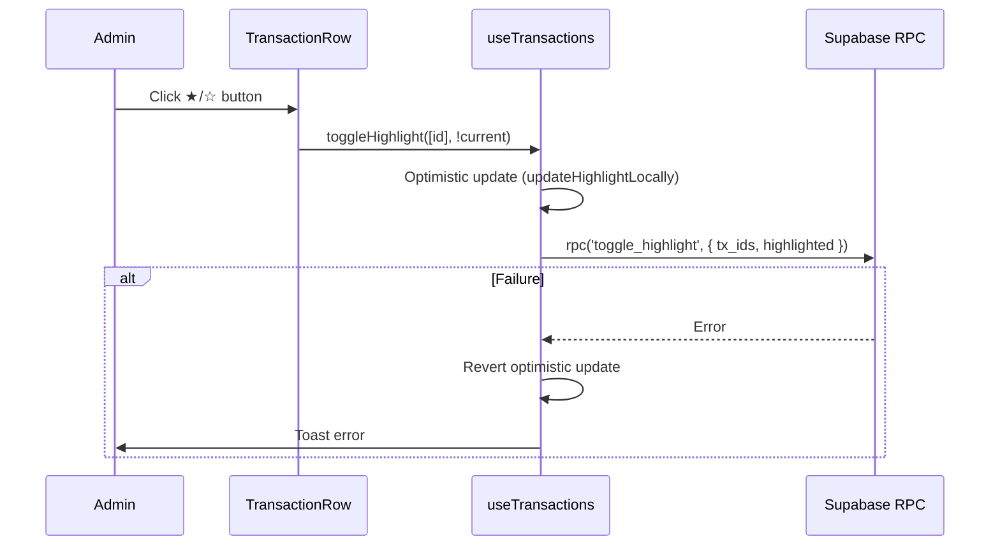
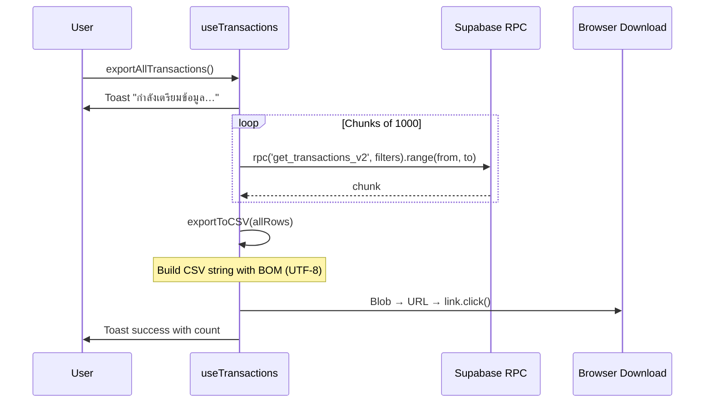

# Workflows

## 1. Authentication Flow

Session restore on mount: `supabase.auth.getSession()` → if session exists, resolve role and render.

---

## 2. CSV Import Flow

**Encoding detection:** Tries `windows-874` (TIS-620) first; falls back to UTF-8 if Thai header not found.  
**Dedup logic:** Server-side — timestamp-existence check. If a `tx_datetime` already exists in DB, all rows with that timestamp are skipped. First upload wins.

---

## 3. Data Loading & Pagination

**Page size:** 75 rows per fetch.  
**Sort:** Default `tx_datetime DESC`, secondary sort by `id`.  
**Dedup:** Client-side Set check on `id` before appending.

---

## 4. Edit Memo (รายการ) Flow

---

## 5. Highlight Toggle (Admin)

---

## 6. CSV Export Flow

---

## 7. Filter & Sort Flow

Filters and sort trigger `resetAndLoad()`:
1. Clear current transactions
2. Reset to page 1
3. Fetch with new params
4. Update stats via `get_transaction_stats_v2`

Sort toggle: clicking same column flips direction (desc→asc→desc). Different column defaults to desc.

Filter types:
- **Global search:** ILIKE across description, memo, cheque_number, channel
- **Column filters:** Individual ILIKE per column (inline inputs in header)
- **Type filter:** Exact match (locked for accountant roles)
- **Date range:** `dateFrom` → `dateTo` (inclusive, appends T23:59:59)
- **Numeric filters:** Exact match on withdraw/deposit/balance amounts
