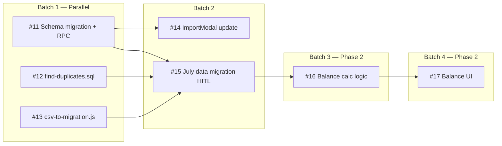

# Dependency Graph

```mermaid
graph LR
  subgraph "Batch 1 — Parallel"
    T11[#11 Schema migration + RPC]
    T12[#12 find-duplicates.sql]
    T13[#13 csv-to-migration.js]
  end
  subgraph "Batch 2"
    T14[#14 ImportModal update]
    T15[#15 July data migration HITL]
  end
  subgraph "Batch 3 — Phase 2"
    T16[#16 Balance calc logic]
  end
  subgraph "Batch 4 — Phase 2"
    T17[#17 Balance UI]
  end
  T11 --> T14
  T11 --> T15
  T12 --> T15
  T13 --> T15
  T15 --> T16
  T16 --> T17
```
