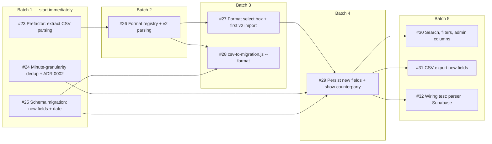

# Dependency Graph — Statement Format v2

Parent spec: [#20](https://github.com/tedyeates/transaction-ledger/issues/20)

## Batches

| Batch | Issues | Notes |
|-------|--------|-------|
| 1 | #23, #24, #25 | No blockers — three agents can run in parallel. Concurrency limit in `project-config.md` is 3. |
| 2 | #26 | Needs the extracted parsing module from #23 |
| 3 | #27, #28 | #27 is the first user-demoable slice |
| 4 | #29 | The payoff slice — new fields actually stored and visible |
| 5 | #30, #31, #32 | Parallel; all three only need #29 |

## Critical path

`#23 → #26 → #27 → #29 → {#30, #31, #32}` — five batches deep. #24 and #25 are off the critical path and can land any time before #29.

## External sequencing note

[#21](https://github.com/tedyeates/transaction-ledger/issues/21) (security: unauthorized RPC reads) proposes replacing `SELECT *` in `get_transactions_v2` with an explicit masked column list. #25 adds twelve columns to `transactions`. Whichever lands second must reconcile that column list, so #21 before #29 is cheaper. Not a hard blocker — no dependency edge recorded.
