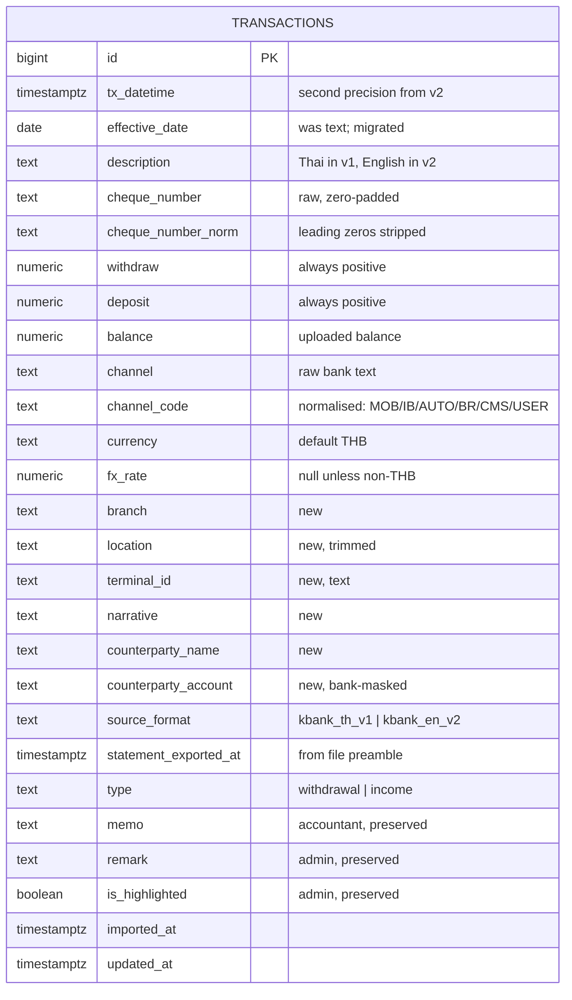
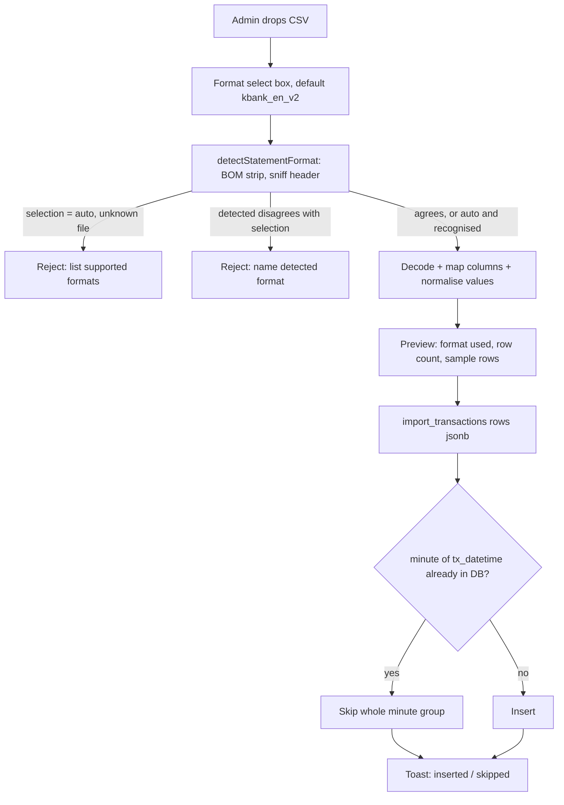
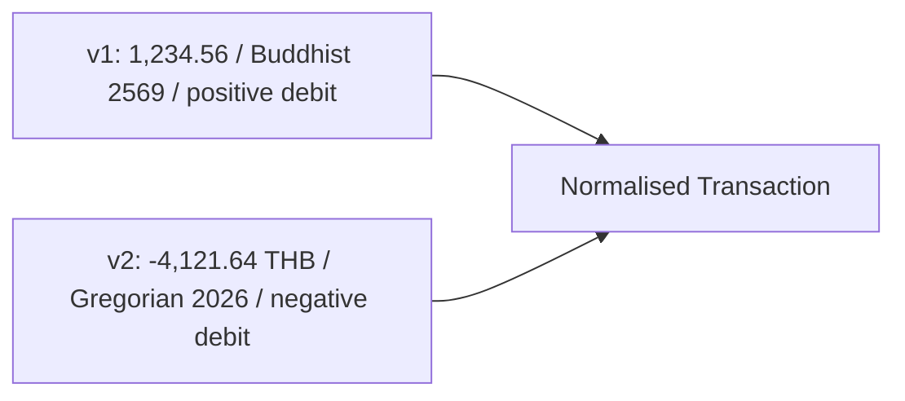

<!-- GitHub: #20 https://github.com/tedyeates/transaction-ledger/issues/20 -->

# Statement Format v2 — English/Gregorian Kasikorn Export

## Problem Statement

The bank has started issuing a second statement export format. `texport.csv` (92 transactions, exported 21/08/2026) is UTF-8 with English headers, Gregorian years, second-precision timestamps, signed amounts with a currency suffix, and 15 columns instead of 8.

The current importer rejects it outright — `parseBankCSV` decodes windows-874 and only accepts a header row starting with `วันที่ทำรายการ`, so the admin gets `ไม่พบหัวตาราง (วันที่ทำรายการ) ในไฟล์ CSV` and cannot import at all. Worse, several failure modes are silent rather than loud: the slash-date branch subtracts 543 from an already-Gregorian year (2026 → 1483), debit amounts arrive negative and would invert every withdrawal total, and second-precision timestamps break Timestamp-existence Dedup against the minute-precision transactions already stored.

Seven new columns of real data (branch, location, terminal, counterparty name and account, narrative, FX rate) are dropped on the floor. Counterparty name is the highest-value one: it names who paid, which today only survives as an accountant's hand-typed Memo.

## Solution

Teach the importer that a bank CSV has a *statement format*, and normalise both formats into one Transaction shape before anything else in the system sees them.

The admin picks the format from a select box in the import modal, defaulting to the new English/Gregorian format since that is what the bank issues now. Detection still runs from the file's own header and is used to confirm the choice — if the file disagrees with the selection, the import is refused with a message naming what was actually detected, rather than parsing the file wrongly.

Parsing becomes a small deep module: bytes plus a chosen format in, `{ format, exportedAt, rows }` out. Format-specific knowledge (encoding, header names, year era, sign convention, currency suffix, channel vocabulary) lives behind that boundary. Everything downstream — ImportModal, `import_transactions`, the table, CSV export, `csv-to-migration.js` — keeps working against normalised rows.

The Transaction gains the eight bank-sourced fields the new format carries, plus provenance (which format, which export). Dedup keeps the accepted Timestamp-existence strategy but compares at minute granularity so second-precision rows dedup correctly against the minute-precision history.

## User Stories

1. As an admin, I want to upload the new English/Gregorian statement export and have it accepted, so that I can keep importing after the bank changed its export format.
2. As an admin, I want to keep uploading the old Thai/TIS-620 export without changes, so that historical files remain importable.
3. As an admin, I want a select box in the import modal listing the supported statement formats, so that I control how a file is read instead of guessing why it parsed oddly.
4. As an admin, I want that select box to default to the new English/Gregorian format, so that the common case is one click with nothing to change.
5. As an admin, I want to switch the select box back to the old Thai format, so that I can import an archived file.
6. As an admin, I want the app to check the file's header against my selection and refuse mismatches, naming the format it actually detected, so that I cannot silently import a file as the wrong format.
7. As an admin, I want an "auto-detect" option available in the select box, so that I can let the file decide when I am unsure which export I have.
8. As an admin, I want an unrecognised file to be rejected with a message naming the formats that are supported, so that I know the file is wrong rather than the app being broken.
9. As an admin, I want transaction dates from the new format stored as the correct calendar year, so that August 2026 transactions do not land in 1483.
10. As an admin, I want second-precision transaction times preserved, so that rows the bank posted in the same minute stay distinguishable.
11. As an admin, I want the negative debit amounts in the new format stored as positive withdrawal amounts, so that stats totals and the withdrawal column stay correct.
12. As an admin, I want `0.00` in the unused amount column to be treated as "no amount", so that every Transaction still has exactly one Amount and its type is derived correctly.
13. As an admin, I want the currency of each amount recorded, so that a future non-THB row is not silently treated as baht.
14. As an admin, I want the FX rate recorded, so that non-THB rows can be reconciled later.
15. As an admin, I want the counterparty name stored and shown in the table, so that I can see who paid without an accountant typing it into Memo.
16. As an admin, I want the masked counterparty account number stored, so that I can match a payment to a customer.
17. As an admin, I want branch, location, and terminal ID stored, so that I can tell where a transaction was posted.
18. As an admin, I want the bank's narrative field stored, so that no data from the statement is discarded even when it is currently empty.
19. As an admin, I want to search by counterparty name, so that I can find all transactions from one customer.
20. As an admin, I want the effective date (Value Date) to sort and filter as a real date, so that ordering by it is meaningful across both formats.
21. As an admin, I want channel values normalised to a common code, so that filtering by "mobile banking" returns both `MOB` rows and `Mobile Phone Banking` rows.
22. As an admin, I want the raw channel text preserved as the bank wrote it, so that normalisation never loses information.
23. As an admin, I want cheque numbers matched regardless of zero padding, so that `02933114` and `0002933114` are recognised as the same cheque.
24. As an admin, I want to know which statement format each Transaction came from, so that I can explain why its description is English or Thai.
25. As an admin, I want the export timestamp from the file header recorded on imported rows, so that I know the statement cutoff each row came from.
26. As an admin, I want the import preview to show counterparty alongside the existing columns, so that I can eyeball the new data before committing.
27. As an admin, I want the import preview to confirm the format it read and how many rows were found, so that I can catch a misparse before inserting.
28. As an admin, I want changing the format select box after a file is loaded to re-parse that file immediately, so that I can correct a wrong choice without re-picking the file.
29. As an admin, I want re-importing an overlapping period not to create duplicates of transactions already stored at minute precision, so that the format switchover does not double my ledger.
30. As an admin, I want the seven rows the bank posted at the same second to all import together, so that batch cheque autopost days are complete.
31. As an admin, I want the CSV export to include the new fields, so that what I download reflects what the system stores.
32. As an admin, I want the trailing whitespace line and two-line preamble in the new format handled, so that no empty Transaction is created.
33. As an accountant (withdrawal/income), I want the new fields visible on the rows I can already see, so that I have the bank's own description of the counterparty when writing a Memo.
34. As an accountant, I want my Memo and the admin's Remark untouched by any of this, so that annotation work survives the format change.
35. As an admin, I want `csv-to-migration.js` to accept the new format too, so that data corrections can be generated from either export without exposing transaction data to third parties.
36. As an admin, I want `csv-to-migration.js` to take the format as a CLI flag defaulting to the new format, so that the script and the UI behave the same way.
37. As a developer, I want one parsing module shared by the app and the migration script, so that a format fix does not have to be made twice.
38. As a developer, I want the real `texport.csv` as a test fixture, so that regressions in format handling are caught by the test suite rather than in production.

## Personas & Roles

No new roles. Existing access boundaries are unchanged; the question this spec answers is which roles see the new columns.

| Role | Can view transactions | Can view balance | Can view new bank fields | Can import | Can edit |
|------|----------------------|------------------|--------------------------|-----------|----------|
| `withdrawal` | withdrawal rows only | no (UI-hidden) | yes — counterparty, branch, location, terminal, narrative, currency | no | Memo on withdrawal rows |
| `income` | income rows only | no (UI-hidden) | yes — same set | no | Memo on income rows |
| `admin` | all rows | yes | yes + FX rate, format, export timestamp | yes | Remark, highlight |

Counterparty name and masked account are treated as bank-sourced descriptive data at the same sensitivity as `description`, so accountants see them. FX rate, `source_format` and `statement_exported_at` are operational metadata and stay admin-visible in the UI.

Pre-existing caveat this spec does not fix: the 13-parameter `get_transactions_v2` the client calls enforces rows by role server-side, but it returns `SELECT *`, so accountants receive `balance` and `remark` over the wire and the UI is what hides them. A 9-parameter overload with no role check at all is also reachable via PostgREST, and both `get_transaction_stats_v2` overloads have no authorization whatsoever while being granted to `anon`. New columns inherit all of this. Tracked as issue #21 and recorded in `.kiro/specs/security.md`; see Out of Scope.

## Diagrams

### Transaction after this spec

### Import flow

### Value normalisation, per format

## Testing Seams

| Seam | Existing/New | Modules it covers | How tests use it |
|------|-------------|-------------------|------------------|
| `parseBankCSV(ArrayBuffer, { format })` | Existing (signature and return shape widen) | format registry, detection guard, column mapping, all value coercion, preamble/trailer handling | Feed real fixture bytes for both formats. Assert: default format parses `texport.csv`; explicit v1 selection on a v2 file throws naming both; `auto` resolves each fixture correctly; `auto` on a junk file throws listing supported formats. Highest available seam for the whole parsing stack — no test reaches the internal coercers directly. |
| `parseBankCSV` under property test | Existing | date era handling, amount sign/currency, cheque and channel normalisation | fast-check generators build synthetic v2 lines; invariants: withdraw/deposit never negative, exactly one of the two set, parsed year equals the year in the input text, seconds preserved. Prior art: `useTransactions.property.test.js`. |
| `import_transactions(rows jsonb)` RPC | Existing | migration, new columns, minute-granularity dedup, admin-only guard | pgTAP via `npx supabase test db`. Cases: all-new minutes insert; seven same-second rows insert together; second-precision row skipped when its minute exists from v1; mixed batch splits correctly; non-admin raises `Permission denied`; new columns round-trip. |
| `ImportModal` component with mocked `supabase.rpc` | Existing | format select box, preview rendering, error surfacing, toast wiring | Existing `ImportModal.test.jsx` pattern — mock `parseBankCSV` return, assert the select box defaults to the new format, that the chosen format is passed through to the parser, that changing the selection re-parses the loaded file, that the preview names the format used and includes counterparty, and that a mismatch throw reaches `role="alert"`. |
| `csv-to-migration.js` module exports | Existing | shared-parser refactor, `--format` flag | Existing `scripts/csv-to-migration.test.js` — run against the v2 fixture with the default and with an explicit flag; assert generated UPDATE statements target the right rows and set the new fields. |
| `TransactionRow` render | Existing | new column display per role | Existing `TransactionRow.test.jsx` pattern — render with a v2-shaped transaction per role, assert counterparty cell present and FX/metadata hidden from accountants. |
| `csv-to-migration.js` module exports | Existing | shared-parser refactor | Existing `scripts/csv-to-migration.test.js` — run against the v2 fixture, assert generated UPDATE statements target the right rows and set the new fields. |
| Wiring check: parser output → local Supabase RPC → read back | **New (optional)** | full path minus browser: `parseBankCSV` → `import_transactions` → `get_transactions_v2` | Node test that reads `texport.csv` from disk, calls the real RPC against local Supabase as the seeded admin, then reads rows back and asserts the new fields and dedup counts. Gated on local Supabase running; skipped otherwise. |

**Is there an E2E test that verifies the full flow is wired together?** No — and there is no e2e infrastructure to build on. No Playwright or Cypress config, no CI e2e stage; `vitest` with jsdom is the only runner. The genuine wiring risk here is parser-output-shape versus RPC-parameter-shape (a field added to the parser but not to the RPC's `jsonb` extraction inserts silent NULLs, and every mocked test still passes). The optional new seam above closes exactly that gap using infrastructure that already exists — `npx supabase start`, `seed.sql` with three seeded role users — without standing up a browser harness. Recommended, not mandated. If it is skipped, the pgTAP suite must assert the new columns explicitly against a hand-written `jsonb` payload copied from real parser output.

## Implementation Decisions

Sequencing follows the repo's frontend-first constraint: parser and UI against fixture data first, migration and RPC second.

### Module: statement format registry (new, `src/lib/csv/`)

Deep module, one public function. Bytes plus a chosen format in, normalised Transactions out.

- `SOURCE_FORMATS` is the registry, ordered for display, each entry carrying an id (`kbank_en_v2`, `kbank_th_v1`), a Thai UI label, encoding preference, header signature, column→field map, and the coercers its columns need. The select box is rendered from this registry, so adding a third bank adds an option without touching the modal.
- `DEFAULT_SOURCE_FORMAT = 'kbank_en_v2'` — the format the bank issues now. Exported as a constant so the modal and `csv-to-migration.js` cannot drift apart.
- `detectStatementFormat(text) → format id | null`. Strip the BOM before comparing — `texport.csv` is UTF-8 with BOM and a naive header compare fails silently.
- `parseBankCSV(arrayBuffer, { format = DEFAULT_SOURCE_FORMAT })` returns `{ format, exportedAt, rows }`, where `format` is the id actually used. `format: 'auto'` defers entirely to detection. Return shape widens from a bare array; `ImportModal` and `csv-to-migration.js` are the only callers.
- **Selection is authoritative for parsing, detection is a guard.** When an explicit format is selected and detection disagrees, the parse throws naming both — the selected format and what the header looked like — rather than parsing the file under the wrong rules. This is the whole point of running detection alongside a manual selector: parsing a Gregorian file as Buddhist produces year 1483 rows that look plausible enough to insert.
- Unknown file under `auto` throws with a Thai message naming both supported formats, replacing today's `ไม่พบหัวตาราง` string.

Two descriptors today; the registry is the seam for a third bank later. It is a real seam, not hypothetical — two adapters exist.

Value coercion rules, all format-driven rather than sniffed:

- **Year era.** v1 subtracts 543 (Buddhist); v2 does not. This cannot be inferred from the digits, which is precisely why the current single `thaiDateStringToISO` misparses v2 as year 1483. The era is a property of the format.
- **Seconds.** v2 timestamps carry `:SS` and it is preserved. v1 has none and stays at `:00`.
- **Amounts.** `parseAmount('-4,121.64 THB') → { value: 4121.64, currency: 'THB' }`: strip separators, strip trailing currency code, `Math.abs()`. Sign is a formatting artefact of the debit column, not data — storing it negative would invert every stats total.
- **Zero sentinel.** v2 writes `0.00` in the unused column where v1 writes blank. Both map to null explicitly. Today this works only because `parseFloat('0.00') || null` coerces 0 to null by accident; an innocent "fix" to that expression would break type derivation.
- **Type.** Unchanged rule: debit present → `withdrawal`, else `income`. Verified against the fixture — 59 debit-zero plus 33 credit-zero equals all 92 rows, so no row has both or neither.
- **Trailer and preamble.** v2 has a two-line preamble (`Export Date and Time` then the timestamp) before the header and a whitespace-only final line. The preamble timestamp is captured as `exportedAt`; the trailer is dropped by the existing stop-on-missing-date rule.
- **Escaped quotes.** `splitCSVLine`'s quote toggle collapses `""` to nothing. Not triggered by this fixture but it silently corrupts any quoted field containing a quote; fixed as part of extracting the module.

### Module: field normalisers (new, inside `src/lib/csv/`)

Not separately seamed — exercised through `parseBankCSV`.

- `channel_code`: `Mobile Phone Banking`↔`MOB`, `Internet Banking`↔`IB`, `Automatic`↔`AUTO`, `Branch  Counter`(double space, trimmed)↔`BR*`, `Cash Management`↔`CMS`, `User`→`USER`. Raw text stays in `channel`; filters move to `channel_code`. Without this, the channel filter silently splits the ledger in two at the switchover date.
- `cheque_number_norm`: leading zeros stripped. v1 emits 8 digits, v2 emits 10 for the same bank numbering (`02933114` vs `0002933140`).
- `location`: trailing spaces trimmed (`'Phra Pradaeng '`).
- `terminal_id`: text, never numeric — values include `0098C0` and leading-zero `020200`.
- `counterparty_name` is stored as the bank truncates it; no attempt to repair truncation.

### Module: schema migration (new SQL migration)

- Add `branch`, `location`, `terminal_id`, `narrative`, `counterparty_name`, `counterparty_account`, `currency` (not null, default `'THB'`), `fx_rate numeric(18,6)`, `channel_code`, `cheque_number_norm`, `source_format`, `statement_exported_at`.
- Convert `effective_date` from `text` to `date` in the same migration, parsing existing `'08 ก.ค. 2569'` values via a Thai-month helper. The migration aborts if any existing value fails to parse rather than nulling it. Display stays Buddhist-era Thai; only storage changes.
- Backfill `source_format = 'kbank_th_v1'` and `channel_code` for existing rows.
- Index `counterparty_name` for search, and `(source_format)` is not indexed — low cardinality, not worth it.
- No unique constraint, consistent with ADR 0001.

### Module: `import_transactions` RPC (modified)

- Signature unchanged: `import_transactions(rows jsonb) → jsonb` returning `{inserted, skipped}`. Admin-only guard unchanged.
- Extract and insert the new fields.
- **Dedup granularity changes from exact timestamp to `date_trunc('minute', tx_datetime)`.** Timestamp-existence Dedup is retained as ADR 0001 decided — only the comparison granularity changes, because the two formats disagree on precision. Without this, re-importing a period already stored from v1 at minute precision double-inserts every row, since `10:35:00` and `10:35:57` are different timestamps for the same Transaction.
- Consequence, consistent with ADR 0001's "first upload wins": a genuinely new v2 transaction in a minute already present from v1 is skipped. Accepted; manual intervention for corrections was already the accepted posture.
- Warrants a new ADR (0002) recording the granularity change and its rationale.

### Module: `csv-to-migration.js` (modified)

Currently carries its own copies of `THAI_MONTHS`, `thaiDateStringToISO`, and `splitCSVLine`. It imports the shared parser instead, so a format fix lands in one place. This is the second consumer that makes the parsing module a real seam rather than a speculative one.

Gains a `--format` flag defaulting to `DEFAULT_SOURCE_FORMAT`, mirroring the modal's select box, and prints the format it used in the generated migration's header comment.

### Modules: display and export (modified)

- **ImportModal gains a format select box**, rendered from `SOURCE_FORMATS`, defaulting to `kbank_en_v2`, positioned above the dropzone so the choice is made before the file lands. Options are the two formats plus "ตรวจจับอัตโนมัติ" (auto-detect). Changing the selection after a file is loaded re-parses the retained file rather than clearing it, so a wrong choice costs one click.
- The preview states the format actually used, not just the row count, so a mismatch is visible before insert. Mismatch and unknown-file errors surface through the existing `role="alert"` error region.
- Table gains a counterparty column for all roles; FX rate and provenance stay admin-only. Column filter keys follow the existing `colX` convention.
- `effective_date` renders through a Buddhist-era date formatter now that it is a `date`.
- Import preview shows the format used and row count, and adds counterparty to the preview columns.
- `get_transactions_v2` adds `counterparty_name` and `narrative` to the free-text search branch, and its channel filter switches to `channel_code`.
- CSV export adds the new fields with Thai headers, keeping the existing BOM + quoted-cell writer.
- ImportModal copy that says TIS-620 and "รายการซ้ำ (วันที่ + ยอดคงเหลือเดิม)" is now wrong on both counts and is rewritten.

### Non-THB amounts

Stored, not displayed differently. Every fixture row is THB with `fx_rate` `0.00`, so multi-currency display and conversion are deferred; `formatBaht` is untouched.

## Testing Decisions

- A good test here asserts what the admin would notice: a file imports, the year is right, the withdrawal total is right, nothing duplicates. Tests go through `parseBankCSV` and the RPC, never through the internal coercers — those are implementation detail behind the module boundary and are covered transitively.
- `texport.csv` moves into a fixtures directory and is committed alongside a trimmed v1 fixture. It contains masked account numbers and Thai company names from a real statement; the masking is the bank's (`0942XXX148`). Treat it as real data and keep it to the 92 rows already present rather than adding more.
- Property tests use `fast-check`, following `useTransactions.property.test.js` and `useTransactions.adminToggle.property.test.js`. Invariants over generated v2 rows: amounts non-negative, exactly one of withdraw/deposit set, round-trip of year and seconds.
- RPC tests follow `supabase/tests/rpc_functions_test.sql`: `tests.authenticate_as` / `tests.clear_auth` helpers, seeded role users, explicit `plan(N)` — run once to get the real assertion count before fixing the plan number, per the corrections log.
- Component tests follow `ImportModal.test.jsx`: mock `../lib/supabase` and the parser, stub `FileReader`, assert on toasts and `role="alert"`.
- Regression tests to write first, because each maps to a silent-failure mode: year 2026 stays 2026; `-4,121.64 THB` becomes `withdraw = 4121.64`; the seven `18/08/2026 21:07:00` rows all insert; a v2 row whose minute exists from v1 is skipped; a v1 file still parses unchanged; and a v2 file selected as v1 is refused rather than parsed into year-1483 rows.

## Out of Scope

- Multi-currency display, FX conversion, or per-currency totals — fields are stored only.
- Normalising `description` across languages (a `description_code` lookup). Raw text is kept; cross-format description search remains language-specific.
- `import_batches` audit table. Provenance is per-row (`source_format`, `statement_exported_at`); the batch table stays out, consistent with the import-dedup-redesign spec which explicitly dropped it.
- Fixing the RPC authorization gaps — missing role checks on the stats functions, the unchecked 9-parameter `get_transactions_v2` overload, absent column masking, and the `anon` grants. Pre-existing, unchanged by this spec, tracked as issue #21 and recorded in `.kiro/specs/security.md`.
- Browser-level e2e infrastructure.
- Repairing bank-truncated counterparty names.
- Reversals or corrections posted to historical timestamps — still manual, per ADR 0001.
- Support for a third bank. The format registry makes it cheap; no descriptor is written now.

## Further Notes

- Glossary terms this introduces, for `CONTEXT.md`: **Statement Format** (a bank export dialect — encoding, header language, year era, sign convention — identified by `source_format`, chosen by the admin at import time and verified against the file's header), **Counterparty** (the other party named by the bank on a transaction, distinct from the accountant's Memo), **Statement Export Timestamp** (the cutoff time in the file preamble). `Timestamp-existence Dedup` needs its definition amended to say minute granularity.
- ADR 0001 stays in force. This spec changes only dedup granularity, which needs ADR 0002.
- Open question for the user: whether a format mismatch should hard-refuse (spec's choice) or warn and let the admin proceed. Hard refuse is safer — a v2 file parsed as v1 yields year-1483 rows that will insert happily.
- Open question for the user: whether the first v2 import should be restricted to dates strictly after the newest stored `tx_datetime`, as a belt-and-braces guard over the switchover boundary. Minute-granularity dedup should make it unnecessary.
- Open question: whether accountants should see `counterparty_account` (masked) or only `counterparty_name`. Spec currently grants both.
- `texport.csv:Zone.Identifier` in the repo root is a WSL download artefact and should be deleted, not committed.
- Fixture facts worth keeping handy: 95 lines, 92 transactions, 82 distinct timestamps, 6 distinct channels, 10 branches, 27 terminal IDs, 12 rows with a counterparty, `Narrative` and `FX Rate` empty/zero throughout.
